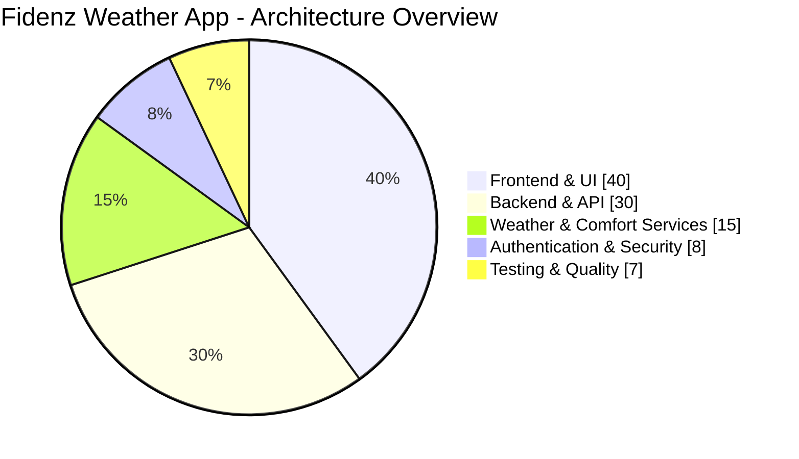
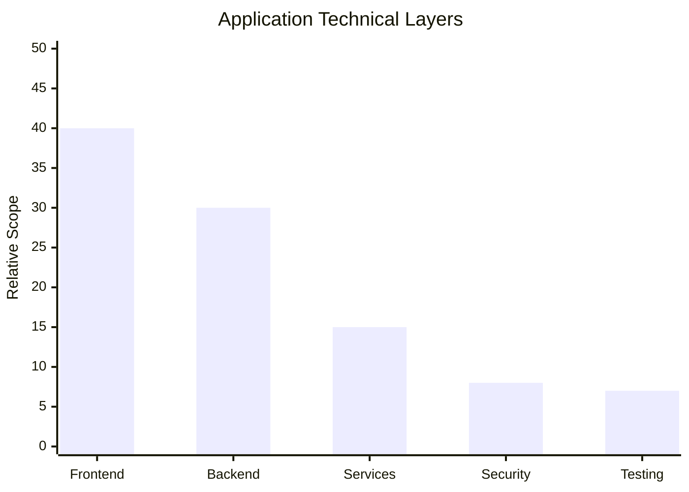
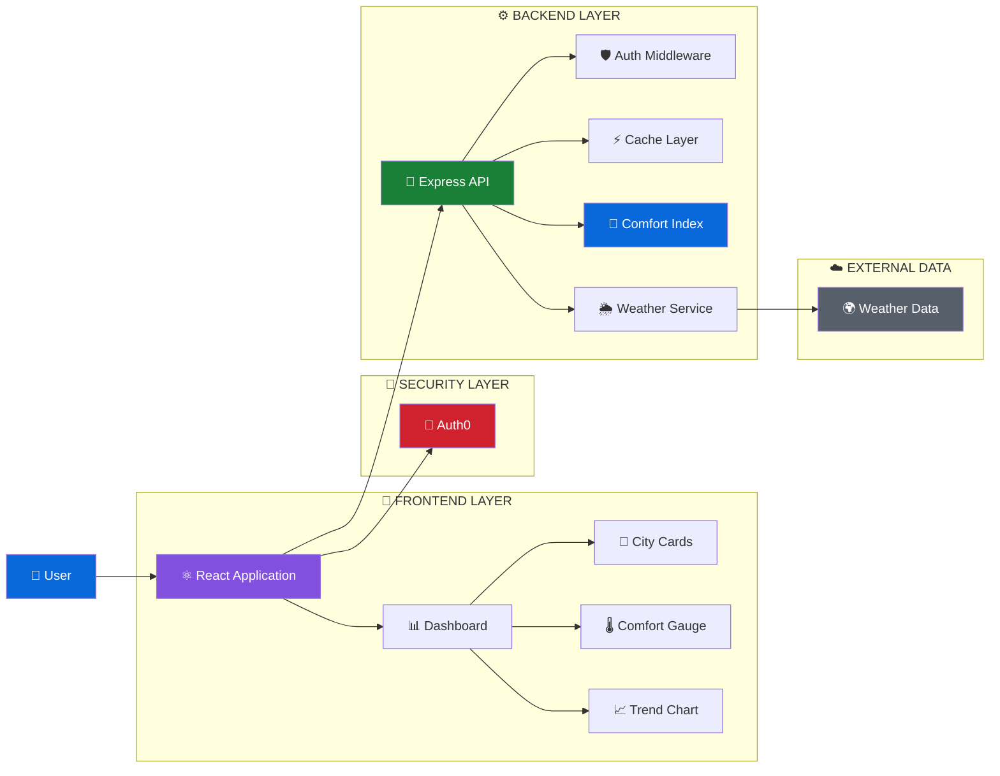
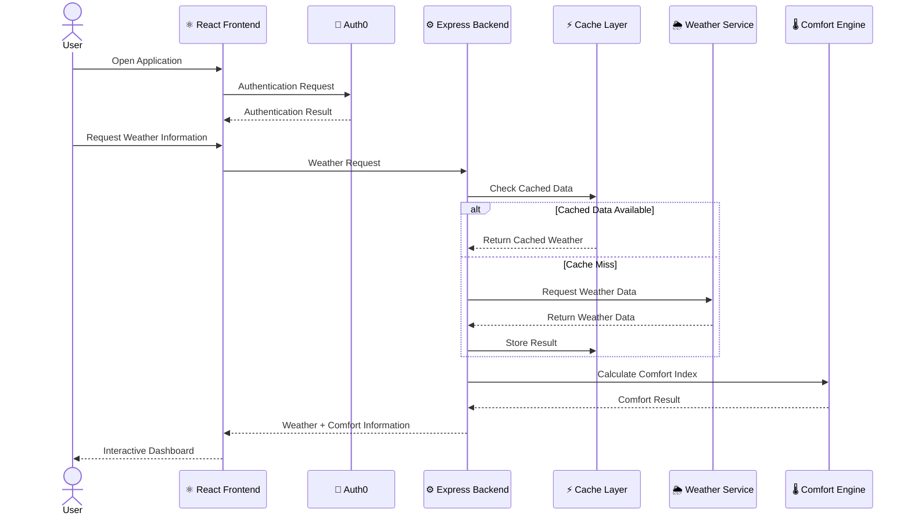
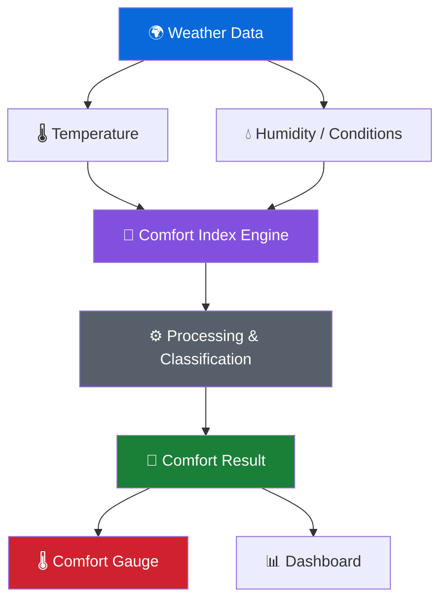
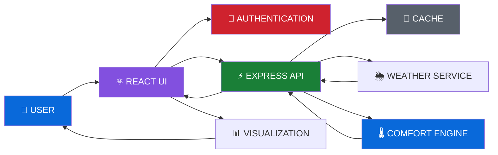
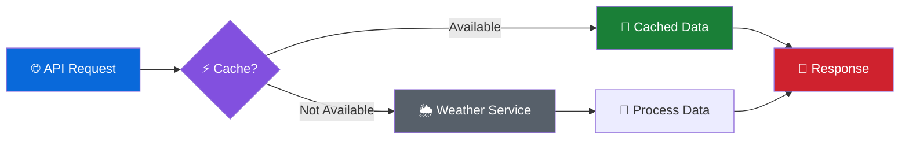
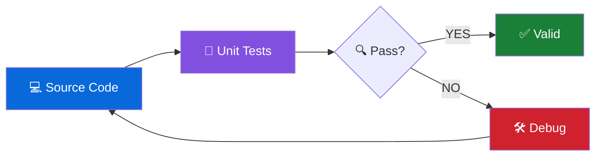
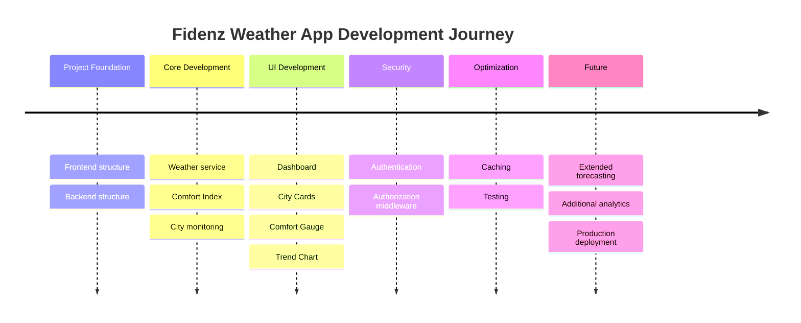
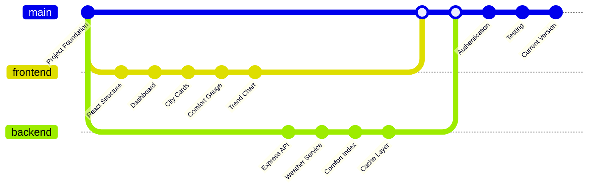

<!-- ============================================================
     FIDENZ WEATHER APP
     Modern Full-Stack Weather Intelligence Platform
     Developed by Ahamed
============================================================= -->

<div align="center">

# 🌦️ FIDENZ WEATHER APP

### ⚡ Intelligent Weather • Comfort Analytics • Real-Time Insights


<br/>


<br/><br/>


<br/><br/>


<br/><br/>

### 🌍 Transforming Weather Data Into Meaningful Human Comfort Insights

**Fidenz Weather App** is a modern full-stack weather intelligence platform
that combines weather information, city-based monitoring, comfort-index
calculations, interactive visualizations, authentication, caching and a
responsive React dashboard.

<br/>

**🚀 Modern • 🌦️ Intelligent • 📊 Interactive • 🔐 Secure • ⚡ Fast**

</div>

---

# 📌 Table of Contents

- [🌦️ About The Project](#️-about-the-project)
- [🎯 Project Vision](#-project-vision)
- [✨ Key Features](#-key-features)
- [🖥️ Application Preview](#️-application-preview)
- [🛠️ Technology Stack](#️-technology-stack)
- [📊 Project Analytics](#-project-analytics)
- [🏗️ System Architecture](#️-system-architecture)
- [🔄 Application Workflow](#-application-workflow)
- [🌡️ Comfort Index Engine](#️-comfort-index-engine)
- [📡 Data Flow](#-data-flow)
- [📁 Project Structure](#-project-structure)
- [🧩 Core Components](#-core-components)
- [🔐 Security](#-security)
- [⚡ Performance](#-performance)
- [🧪 Testing](#-testing)
- [🚀 Getting Started](#-getting-started)
- [🔧 Environment Configuration](#-environment-configuration)
- [🧠 Engineering Principles](#-engineering-principles)
- [🗺️ Development Roadmap](#️-development-roadmap)
- [✔️ Feature Progress](#️-feature-progress)
- [💻 Technical Skills](#-technical-skills-demonstrated)
- [📈 Repository Activity](#-repository-activity)
- [🔥 Development Activity](#-development-activity)
- [🤝 Contributing](#-contributing)
- [🐛 Issues & Feedback](#-issues--feedback)
- [👨‍💻 Developer](#-developer)
- [⭐ Support The Project](#-support-the-project)

---

# 🌦️ About The Project

The **Fidenz Weather App** is designed to make weather information easier
to understand through a modern, responsive and interactive web experience.

Instead of presenting only raw weather values, the application processes
environmental information and provides a dedicated **Comfort Index**, helping
users interpret weather conditions in a more meaningful and user-friendly way.

The project demonstrates a complete **full-stack architecture**, combining
a React-based frontend with a Node.js and Express backend, authentication,
weather services, caching, visualization components and automated testing.

The application follows a modular architecture so that the frontend,
backend, weather-processing logic, security and testing responsibilities
remain clearly separated.

---

# 🎯 Project Vision

<div align="center">

### 🌍 WEATHER DATA → 🧠 INTELLIGENCE → 🌡️ COMFORT → 📊 VISUALIZATION

</div>

The main vision behind the project is to transform technical weather
information into a clean digital experience that can be understood quickly.

### 🎯 Main Objectives

> 🌡️ Convert weather information into meaningful comfort insights  
> 🌍 Provide city-based weather monitoring  
> 📊 Visualize weather trends through interactive components  
> ⚡ Deliver a responsive and efficient user experience  
> 🔐 Protect application functionality using authentication  
> 🧠 Demonstrate clean full-stack software architecture  
> 🧪 Maintain reliable application logic through testing  
> 🚀 Build a scalable foundation for future improvements  

---

# ✨ Key Features

<table>
<tr>

<td width="50%" valign="top">

### 🌡️ Weather Intelligence

- City-based weather information
- Environmental condition processing
- Temperature analysis
- Weather trend visualization
- Dynamic weather presentation
- Structured weather-service layer

</td>

<td width="50%" valign="top">

### 🎯 Comfort Analytics

- Dedicated Comfort Index engine
- Human-readable comfort information
- Dynamic comfort calculations
- Visual Comfort Gauge
- Condition-based analysis
- Separate calculation logic

</td>

</tr>

<tr>

<td width="50%" valign="top">

### 📊 Interactive Dashboard

- Modern dashboard interface
- City cards
- Trend charts
- Comfort visualization
- Responsive layout
- Component-based design

</td>

<td width="50%" valign="top">

### 🔐 Application Security

- Auth0 integration
- Authentication flow
- Authorization middleware
- Environment-variable configuration
- Protected backend functionality
- Secure configuration structure

</td>

</tr>

<tr>

<td width="50%" valign="top">

### ⚡ Performance

- Backend caching
- Optimized API communication
- Vite development environment
- Modular components
- Reusable frontend architecture
- Reduced unnecessary data requests

</td>

<td width="50%" valign="top">

### 🧪 Quality Assurance

- Comfort Index unit testing
- Modular backend logic
- Environment templates
- Git version control
- Structured project organization
- Maintainable source structure

</td>

</tr>
</table>

---

# 🖥️ Application Preview

<div align="center">

## 🌆 Modern Weather Intelligence Dashboard

### ⚡ Clean • Responsive • Data-Driven • User-Friendly

</div>

> 📸 **Application Screenshot Area**
>
> Add a screenshot of the completed dashboard to an `assets` directory
> and enable the following line when the image exists:
>
> ``

This section is intentionally configured without a missing image so the
README will not display a broken image icon before a real screenshot is added.

---

# 🛠️ Technology Stack

<div align="center">

## 🎨 FRONTEND


### ⚙️ BACKEND


### 🔐 SECURITY


### 🛠️ DEVELOPMENT TOOLS


</div>

---

# 📊 Project Analytics

> **Note:** The following visualizations describe the project's architecture
> and technical composition. They are project documentation diagrams rather
> than automatically measured GitHub language statistics.

## 🥧 Application Architecture Distribution



### Architecture Overview

| Layer | Relative Scope | Purpose |
|---|:---:|---|
| 🎨 Frontend & UI | `40%` | Dashboard and visual experience |
| ⚙️ Backend & API | `30%` | Server and API processing |
| 🌦️ Weather & Comfort | `15%` | Weather and comfort intelligence |
| 🔐 Security | `8%` | Authentication and authorization |
| 🧪 Testing | `7%` | Application reliability |

---

## 📊 Technical Layer Bar Graph



---

## ⚡ Development Capability Matrix

| Area | Progress |
|:---|:---|
| 🎨 Frontend Development | `████████████████████` |
| ⚙️ Backend Development | `██████████████████░░` |
| 🌐 REST/API Integration | `██████████████████░░` |
| 🔐 Authentication | `████████████████░░░░` |
| 📊 Data Visualization | `█████████████████░░░` |
| 🧪 Testing | `██████████████░░░░░░` |
| 🔀 Git / GitHub | `███████████████████░` |

---

# 🏗️ System Architecture



---

# 🔄 Application Workflow



---

# 🌡️ Comfort Index Engine

The **Comfort Index Engine** is one of the core backend components of the
Fidenz Weather App.

It transforms environmental information into a more understandable
representation of how comfortable current weather conditions may feel.



### Processing Concept

```text
┌──────────────────────────────┐
│      🌍 WEATHER DATA         │
└──────────────┬───────────────┘
               │
               ▼
┌──────────────────────────────┐
│ 🌡️ ENVIRONMENTAL PARAMETERS │
└──────────────┬───────────────┘
               │
               ▼
┌──────────────────────────────┐
│ 🧠 COMFORT INDEX CALCULATION │
└──────────────┬───────────────┘
               │
               ▼
┌──────────────────────────────┐
│ 🎯 COMFORT CLASSIFICATION    │
└──────────────┬───────────────┘
               │
               ▼
┌──────────────────────────────┐
│ 📊 DASHBOARD VISUALIZATION   │
└──────────────────────────────┘
```

---

# 📡 Data Flow



---

# 📁 Project Structure

```text
Fidenz-Weather-App/
│
├── 📂 backend/
│   │
│   ├── 📂 middleware/
│   │   └── auth.js
│   │
│   ├── 📂 tests/
│   │   └── comfortIndex.test.js
│   │
│   ├── .env.example
│   ├── cache.js
│   ├── cities.json
│   ├── comfortIndex.js
│   ├── package.json
│   ├── package-lock.json
│   ├── server.js
│   └── weatherService.js
│
├── 📂 frontend/
│   │
│   ├── 📂 src/
│   │   │
│   │   ├── 📂 auth/
│   │   │   └── Auth0ProviderWithConfig.jsx
│   │   │
│   │   ├── 📂 components/
│   │   │   ├── CityCard.jsx
│   │   │   ├── ComfortGauge.jsx
│   │   │   ├── Dashboard.jsx
│   │   │   └── TrendChart.jsx
│   │   │
│   │   ├── App.jsx
│   │   ├── index.css
│   │   └── main.jsx
│   │
│   ├── .env.example
│   ├── index.html
│   ├── package.json
│   ├── package-lock.json
│   └── vite.config.js
│
├── .gitignore
└── README.md
```

---

# 🧩 Core Components

| Component | Layer | Responsibility |
|:---|:---:|:---|
| 📊 `Dashboard.jsx` | Frontend | Main application dashboard |
| 🌆 `CityCard.jsx` | Frontend | Presents city-specific weather information |
| 🌡️ `ComfortGauge.jsx` | Frontend | Visual representation of comfort information |
| 📈 `TrendChart.jsx` | Frontend | Weather trend visualization |
| 🔑 `Auth0ProviderWithConfig.jsx` | Security | Authentication configuration |
| ⚙️ `server.js` | Backend | Main backend server |
| 🌦️ `weatherService.js` | Backend | Weather-service integration |
| 🎯 `comfortIndex.js` | Backend | Comfort Index calculation |
| ⚡ `cache.js` | Backend | Application caching |
| 🛡️ `auth.js` | Security | Backend authentication middleware |
| 🧪 `comfortIndex.test.js` | Testing | Comfort Index tests |

---

# 🔐 Security

Security is integrated into the architecture instead of being treated
as an afterthought.

## 🛡️ Security Features

```text
🔐 Authentication
        │
        ├── 🔑 Auth0 Integration
        │
        ├── 🛡️ Authorization Middleware
        │
        ├── 🔒 Environment Configuration
        │
        ├── 📁 Secret Exclusion
        │
        └── 🌐 Controlled API Communication
```

### Implemented Security Practices

- 🔐 Authentication integration
- 🔑 Auth0 configuration
- 🛡️ Backend authentication middleware
- 🔒 Environment-based configuration
- 📁 `.env` files excluded from version control
- 📝 `.env.example` templates
- ⚙️ Separation between frontend and backend responsibilities
- 🔍 Controlled API communication

### ⚠️ Environment Security

Never commit real credentials, secrets, API keys or authentication tokens.

```text
.env
```

should remain excluded through `.gitignore`.

Only templates such as:

```text
.env.example
```

should be committed.

---

# ⚡ Performance

The project includes architectural decisions intended to improve efficiency
and maintainability.

### ⚡ Performance Strategy



### Performance Features

- ⚡ Backend caching
- 📦 Modular application structure
- 🚀 Vite-powered frontend development
- 🌐 Organized API communication
- 🧩 Reusable React components
- 🔄 Reduced unnecessary data processing

---

# 🧪 Testing

The backend contains dedicated testing for the Comfort Index functionality.

### 🧪 Testing Pipeline



### Run Tests

```bash
cd backend
npm test
```

Testing helps verify that core calculations continue to behave correctly
as the application evolves.

---

# 🚀 Getting Started

## 1️⃣ Clone the Repository

```bash
git clone https://github.com/Ahamed369/Fidenz-Weather-App.git
```

Move into the project:

```bash
cd Fidenz-Weather-App
```

---

## 2️⃣ Backend Setup

Navigate to the backend:

```bash
cd backend
```

Install dependencies:

```bash
npm install
```

Create your environment file based on:

```text
.env.example
```

Then start the backend using the script configured in:

```text
backend/package.json
```

---

## 3️⃣ Frontend Setup

Open another terminal and navigate to:

```bash
cd frontend
```

Install dependencies:

```bash
npm install
```

Create your frontend environment configuration based on:

```text
.env.example
```

Start the Vite development environment:

```bash
npm run dev
```

---

# 🔧 Environment Configuration

The project contains environment templates for both application layers.

```text
backend/.env.example
frontend/.env.example
```

### Linux / macOS

```bash
cp .env.example .env
```

### Windows PowerShell

```powershell
Copy-Item .env.example .env
```

Configure the required values locally.

> ⚠️ **IMPORTANT**
>
> Never expose real API keys, Auth0 secrets, authentication tokens,
> passwords or private credentials in the repository.

---

# 🧠 Engineering Principles

The application demonstrates several important software-engineering concepts:

```text
╔════════════════════════════════════════════════════╗
║          🌦️ FIDENZ WEATHER ENGINEERING           ║
╠════════════════════════════════════════════════════╣
║                                                    ║
║  ⚛️  Component-Based Frontend Architecture        ║
║  ⚙️  Separation of Concerns                       ║
║  🔐  Authentication & Authorization               ║
║  🌐  API-Based Communication                      ║
║  ⚡  Caching & Performance                        ║
║  🧪  Automated Testing                            ║
║  🔑  Environment Configuration                    ║
║  📦  Dependency Management                        ║
║  🔀  Git Version Control                          ║
║  🧩  Modular Development                          ║
║                                                    ║
╚════════════════════════════════════════════════════╝
```

---

# 🗺️ Development Roadmap



---

# ✔️ Feature Progress

| Feature | Status |
|---|:---:|
| ⚛️ React Frontend | ✅ Complete |
| 🟢 Node.js Backend | ✅ Complete |
| ⚙️ Express API | ✅ Complete |
| 🌦️ Weather Service | ✅ Complete |
| 🌡️ Comfort Index Engine | ✅ Complete |
| 🌆 City Cards | ✅ Complete |
| 🎯 Comfort Gauge | ✅ Complete |
| 📈 Trend Visualization | ✅ Complete |
| 🔐 Authentication | ✅ Complete |
| 🛡️ Authorization Middleware | ✅ Complete |
| ⚡ Backend Caching | ✅ Complete |
| 🧪 Unit Testing | ✅ Complete |
| 🔑 Environment Configuration | ✅ Complete |
| 🌤️ Extended Forecasting | 🔄 Future |
| 📊 Additional Analytics | 🔄 Future |
| 🚀 Production Deployment | 🔄 Future |

---

# 💻 Technical Skills Demonstrated

<div align="center">

## 🎨 Frontend Engineering


`React.js` • `JavaScript` • `HTML5` • `CSS3` • `Vite`

### ⚙️ Backend Engineering


`Node.js` • `Express.js` • `REST API`

### 🔐 Application Security


`Authentication` • `Authorization` • `Auth0` • `Environment Variables`

### 🌐 Data & Integration

`Weather API Integration` • `JSON` • `Caching` • `Data Processing`

### 📊 UI & Visualization

`Responsive Design` • `Dashboard Development` • `Charts` • `Component Architecture`

### 🧠 Software Engineering

`Modular Architecture` • `Testing` • `Debugging` • `Git` • `GitHub` • `npm`

</div>

---

# 📈 Repository Activity

<div align="center">

## 📊 Development Overview


<br/><br/>

| Repository Information | Details |
|:---|:---|
| 📦 Repository | `Fidenz-Weather-App` |
| 👨‍💻 Developer | `Ahamed` |
| 🔀 Main Branch | `main` |
| 🌐 Project Type | `Full-Stack Web Application` |
| ⚛️ Frontend | `React.js + Vite` |
| ⚙️ Backend | `Node.js + Express.js` |
| 🔐 Authentication | `Auth0` |
| 🧪 Testing | `Unit Testing` |
| 🔀 Version Control | `Git + GitHub` |
| 🟢 Development Status | `Active` |

</div>

---

# 🔥 Development Activity

Instead of depending on an external GitHub activity-image service, this
section uses a native GitHub-rendered development diagram.



<div align="center">

### 💻 Full-Stack Development Journey

**Planning**
→
**Frontend**
→
**Backend**
→
**API Integration**
→
**Security**
→
**Testing**
→
**Optimization**

<br/><br/>

🟦 **DESIGN**
&nbsp;&nbsp;•&nbsp;&nbsp;
🟪 **DEVELOP**
&nbsp;&nbsp;•&nbsp;&nbsp;
🟩 **TEST**
&nbsp;&nbsp;•&nbsp;&nbsp;
🟥 **DEBUG**
&nbsp;&nbsp;•&nbsp;&nbsp;
🚀 **IMPROVE**

</div>

---

# 🤝 Contributing

Contributions, improvements, suggestions and bug reports are welcome.

### 🔄 Contribution Workflow


### Fork the repository and clone your fork

```bash
git clone https://github.com/YOUR-USERNAME/Fidenz-Weather-App.git
```

### Create a feature branch

```bash
git checkout -b feature/your-feature
```

### Add your changes

```bash
git add .
```

### Commit your changes

```bash
git commit -m "Add new feature"
```

### Push your branch

```bash
git push origin feature/your-feature
```

Then create a **Pull Request**.

---

# 🐛 Issues & Feedback

Found a bug or have an idea for an improvement?

Use the repository's **Issues** section to report:

- 🐛 Bugs
- 💡 Feature requests
- 🎨 UI/UX improvements
- ⚡ Performance improvements
- 🔐 Security concerns
- 📚 Documentation improvements

Constructive feedback and contributions are welcome.

---

# 👨‍💻 Developer

<div align="center">

# 👋 Ahamed

### 🎓 Computer Science Undergraduate
### 💻 Full-Stack Developer

<br/>


<br/>

Building modern web applications and digital solutions with a focus on
clean architecture, responsive interfaces, backend development,
API integration, security and user experience.

<br/><br/>

<a href="https://github.com/Ahamed369">

</a>

<a href="https://www.linkedin.com/in/mr-ahamed-6146a5276">

</a>

<br/><br/>

### 💻 DEVELOPMENT FOCUS


<br/>

`Full-Stack Development`
&nbsp; • &nbsp;
`Web Applications`
&nbsp; • &nbsp;
`Software Development`
&nbsp; • &nbsp;
`API Development`
&nbsp; • &nbsp;
`UI/UX`
&nbsp; • &nbsp;
`Application Security`

</div>

---

# ⭐ Support The Project

<div align="center">

## 🌟 If you found this project interesting or useful, consider giving the repository a star.

<br/>

### ⭐ STAR &nbsp; • &nbsp; 🍴 FORK &nbsp; • &nbsp; 🔀 CONTRIBUTE

<br/>


<br/>

---

# 🌦️ FIDENZ WEATHER APP

### Real-Time Weather Intelligence
### Comfort Analytics
### Modern Full-Stack Engineering

<br/>


<br/><br/>


<br/><br/>

### 💙 Built with passion for modern software engineering.

**© 2026 Ahamed • Fidenz Weather App**

<br/>

`React` • `Node.js` • `Express` • `Vite` • `Auth0` • `JavaScript` • `Git` • `GitHub`

<br/>

### 🌦️ ⚡ 📊 🔐 🚀

</div>

<!-- ============================================================
     END OF FIDENZ WEATHER APP README
============================================================= -->
