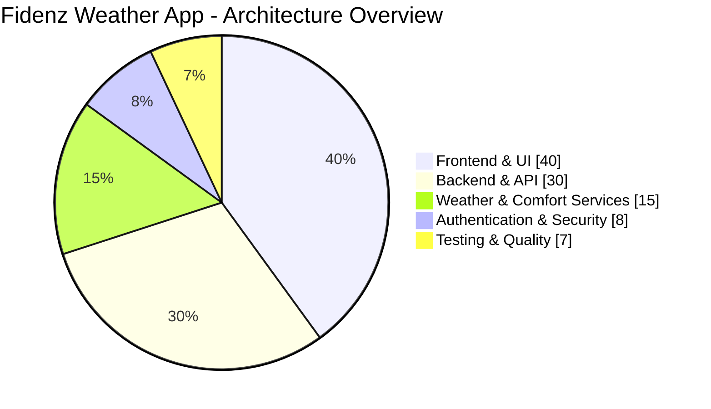
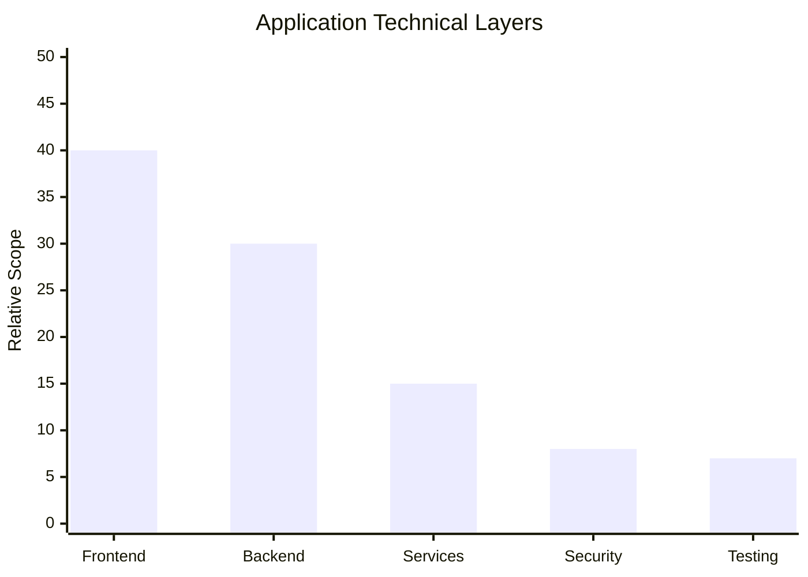
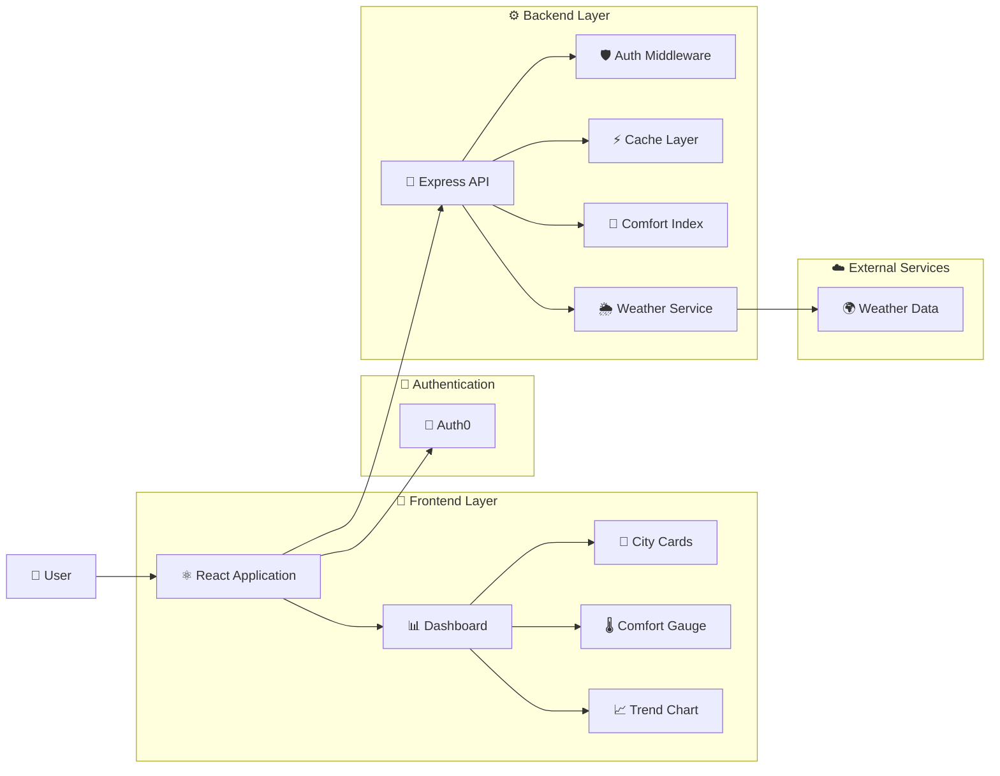
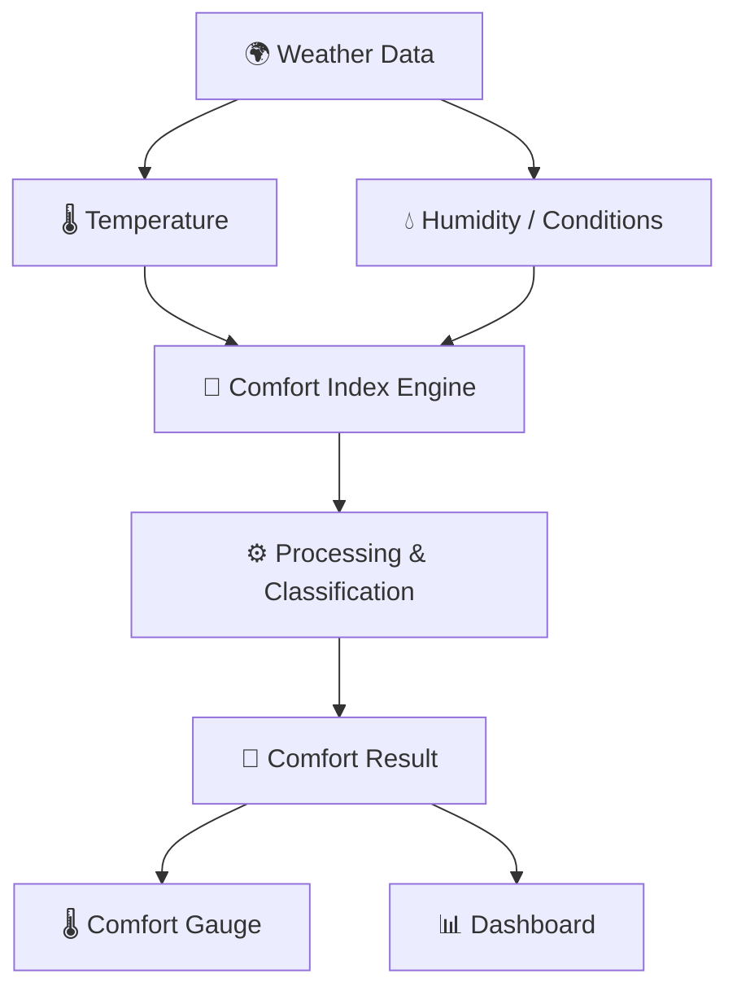
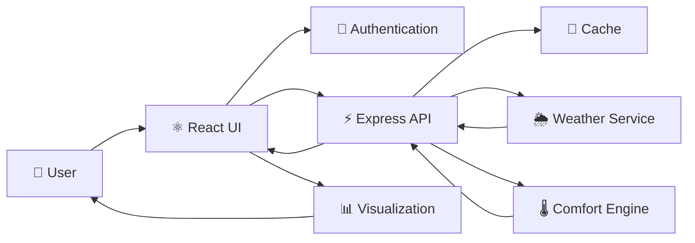
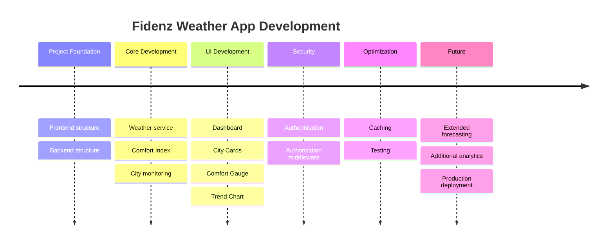

<!-- ============================================================
     FIDENZ WEATHER APP
     Developed by Ahamed
============================================================= -->

<div align="center">

# 🌦️ FIDENZ WEATHER APP

### ⚡ Intelligent Weather • Comfort Analytics • Real-Time Insights


<br/>

<p>
  
  
  
  
</p>

<p>
  
  
</p>

---

### 🌍 Transforming Weather Data Into Meaningful Human Comfort Insights

**Fidenz Weather App** is a modern full-stack weather intelligence platform that combines weather information, city-based monitoring, comfort-index calculations, interactive visualizations, authentication, caching, and a responsive React dashboard.

[🚀 Getting Started](#-getting-started) •
[✨ Features](#-key-features) •
[🛠 Tech Stack](#-technology-stack) •
[🏗 Architecture](#-system-architecture) •
[📊 Analytics](#-project-analytics) •
[👨‍💻 Developer](#-developer)

</div>

---

# 📌 Table of Contents

- [About The Project](#-about-the-project)
- [Key Features](#-key-features)
- [Application Preview](#️-application-preview)
- [Technology Stack](#-technology-stack)
- [Project Analytics](#-project-analytics)
- [System Architecture](#-system-architecture)
- [Application Workflow](#-application-workflow)
- [Comfort Index Engine](#️-comfort-index-engine)
- [Project Structure](#-project-structure)
- [Core Components](#-core-components)
- [Security](#-security)
- [Testing](#-testing)
- [Getting Started](#-getting-started)
- [Environment Configuration](#-environment-configuration)
- [Development Roadmap](#️-development-roadmap)
- [Technical Skills](#-technical-skills-demonstrated)
- [Developer](#-developer)

---

# 🌦 About The Project

The **Fidenz Weather App** is designed to make weather information easier to understand through a modern and interactive web experience.

Instead of presenting only raw weather values, the application processes environmental information and provides a dedicated **Comfort Index**, helping users interpret weather conditions more meaningfully.

The project demonstrates a complete **full-stack architecture**, combining a React-based frontend with a Node.js/Express backend, authentication, weather services, caching, visualization components, and automated testing.

### 🎯 Main Objectives

> 🌡️ Convert weather information into meaningful comfort insights  
> 🌍 Provide city-based weather monitoring  
> 📊 Visualize weather trends through interactive components  
> ⚡ Deliver a responsive and efficient user experience  
> 🔐 Protect application functionality using authentication  
> 🧠 Demonstrate clean full-stack software architecture  

---

# ✨ Key Features

<table>
<tr>
<td width="50%">

### 🌡️ Weather Intelligence

- City-based weather information
- Environmental condition processing
- Temperature analysis
- Weather trend visualization
- Dynamic data presentation

</td>
<td width="50%">

### 🎯 Comfort Analytics

- Dedicated Comfort Index engine
- Human-readable comfort information
- Dynamic comfort calculations
- Visual Comfort Gauge
- Condition-based analysis

</td>
</tr>

<tr>
<td width="50%">

### 📊 Interactive Dashboard

- Modern dashboard interface
- City cards
- Trend charts
- Comfort visualization
- Responsive layout

</td>
<td width="50%">

### 🔐 Application Security

- Auth0 integration
- Authentication flow
- Authorization middleware
- Environment-variable configuration
- Protected backend functionality

</td>
</tr>

<tr>
<td width="50%">

### ⚡ Performance

- Backend caching
- Optimized API communication
- Vite development environment
- Modular components
- Reusable frontend architecture

</td>
<td width="50%">

### 🧪 Quality Assurance

- Comfort Index unit testing
- Modular backend logic
- Environment templates
- Git version control
- Structured project organization

</td>
</tr>
</table>

---

# 🖥️ Application Preview

<div align="center">

### 🌆 Modern Weather Intelligence Dashboard

> Add your application screenshot here for the strongest GitHub presentation.

```html

```

</div>

---

# 🛠 Technology Stack

<div align="center">

## 🎨 Frontend

<p>

</p>


## ⚙️ Backend

<p>

</p>


## 🛠 Development Tools

<p>

</p>


</div>

---

# 📊 Project Analytics

> The following diagrams are architectural/project visualizations rather than measured GitHub language statistics.

## 🥧 Application Architecture Distribution



---

## 📊 Technical Layer Overview



---

## ⚡ Development Capability Matrix

| Area | Level |
|---|---|
| Frontend Development | ████████████████████ |
| Backend Development | ██████████████████░░ |
| REST/API Integration | ██████████████████░░ |
| Authentication | ████████████████░░░░ |
| Data Visualization | █████████████████░░░ |
| Testing | ██████████████░░░░░░ |
| Git / GitHub | ███████████████████░ |

---

# 🏗 System Architecture



---

# 🔄 Application Workflow

```mermaid
sequenceDiagram

    actor User
    participant React as React Frontend
    participant Auth as Auth0
    participant API as Express Backend
    participant Cache as Cache Layer
    participant Weather as Weather Service
    participant Comfort as Comfort Engine

    User->>React: Open Application

    React->>Auth: Authentication Request
    Auth-->>React: Authentication Result

    User->>React: Request Weather Information

    React->>API: Weather Request

    API->>Cache: Check Cached Data

    alt Cached Data Available
        Cache-->>API: Return Cached Weather
    else Cache Miss
        API->>Weather: Request Weather Data
        Weather-->>API: Return Weather Data
        API->>Cache: Store Result
    end

    API->>Comfort: Calculate Comfort Index
    Comfort-->>API: Comfort Result

    API-->>React: Weather + Comfort Information

    React-->>User: Interactive Dashboard
```



---

# 🌡️ Comfort Index Engine

The **Comfort Index Engine** is one of the core backend components of the application.

It transforms environmental information into a more understandable representation of how comfortable current weather conditions may feel.



### Processing Concept

```text
Weather Information
        │
        ▼
Environmental Parameters
        │
        ▼
Comfort Index Calculation
        │
        ▼
Comfort Classification
        │
        ▼
Visual Dashboard Representation
```

---

# 📁 Project Structure

```text
Fidenz-Weather-App/
│
├── 📂 backend/
│   │
│   ├── 📂 middleware/
│   │   └── auth.js
│   │
│   ├── 📂 tests/
│   │   └── comfortIndex.test.js
│   │
│   ├── .env.example
│   ├── cache.js
│   ├── cities.json
│   ├── comfortIndex.js
│   ├── package.json
│   ├── package-lock.json
│   ├── server.js
│   └── weatherService.js
│
├── 📂 frontend/
│   │
│   ├── 📂 src/
│   │   │
│   │   ├── 📂 auth/
│   │   │   └── Auth0ProviderWithConfig.jsx
│   │   │
│   │   ├── 📂 components/
│   │   │   ├── CityCard.jsx
│   │   │   ├── ComfortGauge.jsx
│   │   │   ├── Dashboard.jsx
│   │   │   └── TrendChart.jsx
│   │   │
│   │   ├── App.jsx
│   │   ├── index.css
│   │   └── main.jsx
│   │
│   ├── .env.example
│   ├── index.html
│   ├── package.json
│   ├── package-lock.json
│   └── vite.config.js
│
├── .gitignore
└── README.md
```

---

# 🧩 Core Components

| Component | Layer | Responsibility |
|:---|:---:|:---|
| `Dashboard.jsx` | Frontend | Main application dashboard |
| `CityCard.jsx` | Frontend | Presents city-specific weather information |
| `ComfortGauge.jsx` | Frontend | Visual representation of comfort information |
| `TrendChart.jsx` | Frontend | Weather trend visualization |
| `Auth0ProviderWithConfig.jsx` | Security | Authentication configuration |
| `server.js` | Backend | Main backend server |
| `weatherService.js` | Backend | Weather-service integration |
| `comfortIndex.js` | Backend | Comfort Index calculation |
| `cache.js` | Backend | Application caching |
| `auth.js` | Security | Backend authentication middleware |
| `comfortIndex.test.js` | Testing | Comfort Index tests |

---

# 🔐 Security

Security is integrated into the architecture instead of being treated as an afterthought.

### 🛡️ Security Features

- 🔐 Authentication integration
- 🔑 Auth0 configuration
- 🛡️ Backend authentication middleware
- 🔒 Environment-based configuration
- 📁 `.env` files excluded from version control
- 📝 `.env.example` templates
- ⚙️ Separation between frontend and backend responsibilities
- 🔍 Controlled API communication

### ⚠️ Environment Security

Never commit real credentials, secrets, API keys, or authentication tokens.

```text
.env
```

should remain excluded through `.gitignore`.

Only templates such as:

```text
.env.example
```

should be committed.

---

# 🧪 Testing

The backend contains dedicated testing for the Comfort Index functionality.

### Run Tests

```bash
cd backend
npm test
```

Testing helps verify that core calculations continue to behave correctly as the application evolves.

---

# 🚀 Getting Started

## 1️⃣ Clone the Repository

```bash
git clone https://github.com/Ahamed369/Fidenz-Weather-App.git
```

Move into the project:

```bash
cd Fidenz-Weather-App
```

---

## 2️⃣ Backend Setup

Navigate to the backend:

```bash
cd backend
```

Install dependencies:

```bash
npm install
```

Create your environment file based on:

```text
.env.example
```

Then start the backend using the script configured in `backend/package.json`.

---

## 3️⃣ Frontend Setup

Open another terminal and navigate to:

```bash
cd frontend
```

Install dependencies:

```bash
npm install
```

Create your frontend environment configuration based on:

```text
.env.example
```

Start the Vite development environment:

```bash
npm run dev
```

---

# 🔧 Environment Configuration

The project contains environment templates for both application layers.

```text
backend/.env.example
frontend/.env.example
```

### Recommended Process

```bash
cp .env.example .env
```

On Windows PowerShell:

```powershell
Copy-Item .env.example .env
```

Configure the required values locally.

> ⚠️ Never expose real API keys, Auth0 secrets, tokens, or private credentials in the repository.

---

# 📡 Data Flow



---

# 🧠 Engineering Principles

The application demonstrates several important software-engineering concepts:

```text
┌───────────────────────────────────────────────┐
│          FIDENZ WEATHER ENGINEERING           │
├───────────────────────────────────────────────┤
│                                               │
│  ⚛️ Component-Based Frontend Architecture    │
│  ⚙️ Separation of Concerns                   │
│  🔐 Authentication & Authorization           │
│  🌐 API-Based Communication                  │
│  ⚡ Caching & Performance                    │
│  🧪 Automated Testing                        │
│  🔑 Environment Configuration                │
│  📦 Dependency Management                    │
│  🔀 Git Version Control                      │
│                                               │
└───────────────────────────────────────────────┘
```

---

# 🗺️ Development Roadmap



---

# ✔️ Feature Progress

| Feature | Status |
|---|:---:|
| React Frontend | ✅ |
| Node.js Backend | ✅ |
| Express API | ✅ |
| Weather Service | ✅ |
| Comfort Index Engine | ✅ |
| City Cards | ✅ |
| Comfort Gauge | ✅ |
| Trend Visualization | ✅ |
| Authentication | ✅ |
| Authorization Middleware | ✅ |
| Backend Caching | ✅ |
| Unit Testing | ✅ |
| Environment Configuration | ✅ |
| Extended Forecasting | 🔄 |
| Additional Analytics | 🔄 |
| Production Deployment | 🔄 |

---

# 💻 Technical Skills Demonstrated

<div align="center">

### Frontend Engineering

`React.js` • `JavaScript` • `HTML5` • `CSS3` • `Vite`

### Backend Engineering

`Node.js` • `Express.js` • `REST API`

### Application Security

`Authentication` • `Authorization` • `Auth0` • `Environment Variables`

### Data & Integration

`Weather API Integration` • `JSON` • `Caching` • `Data Processing`

### UI & Visualization

`Responsive Design` • `Dashboard Development` • `Charts` • `Component Architecture`

### Software Engineering

`Modular Architecture` • `Testing` • `Debugging` • `Git` • `GitHub` • `npm`

</div>

---

# 📈 Repository Activity

<div align="center">


</div>

---

# 🔥 GitHub Contribution Activity

<div align="center">


</div>

---

# 🌊 Contribution Animation

<div align="center">


</div>

> The contribution snake requires the corresponding GitHub Actions workflow in your profile repository. If that workflow is not configured, this image will not appear.

---

# 🤝 Contributing

Contributions, improvements, suggestions, and bug reports are welcome.

### Contribution Workflow

```bash
# Fork the repository

# Clone your fork
git clone https://github.com/YOUR-USERNAME/Fidenz-Weather-App.git

# Create a feature branch
git checkout -b feature/your-feature

# Add your changes
git add .

# Commit
git commit -m "Add new feature"

# Push
git push origin feature/your-feature
```

Then create a **Pull Request**.

---

# 🐛 Issues & Feedback

Found a bug or have an idea for an improvement?

Use the repository's **Issues** section to report:

- 🐛 Bugs
- 💡 Feature requests
- 🎨 UI/UX improvements
- ⚡ Performance improvements
- 🔐 Security concerns
- 📚 Documentation improvements

---

# 👨‍💻 Developer

<div align="center">

## **Ahamed**

### Computer Science Undergraduate | Full-Stack Developer

Building modern web applications and digital solutions with a focus on clean architecture, responsive interfaces, backend development, API integration, security, and user experience.

<br/>

<a href="https://github.com/Ahamed369">

</a>

<a href="https://www.linkedin.com/in/mr-ahamed-6146a5276">

</a>

<br/><br/>

### 💻 Development Focus

`Full-Stack Development`
&nbsp; • &nbsp;
`Web Applications`
&nbsp; • &nbsp;
`Software Development`
&nbsp; • &nbsp;
`API Development`
&nbsp; • &nbsp;
`UI/UX`
&nbsp; • &nbsp;
`Application Security`

</div>

---

# ⭐ Support The Project

<div align="center">

If you found this project interesting or useful, consider giving the repository a ⭐.

### ⭐ STAR • 🍴 FORK • 🔀 CONTRIBUTE

<br/>


<br/>

---

### 🌦️ FIDENZ WEATHER APP

**Real-Time Weather Intelligence • Comfort Analytics • Modern Full-Stack Engineering**

<br/>


<br/>

**© 2026 Ahamed • Fidenz Weather App**

</div>
